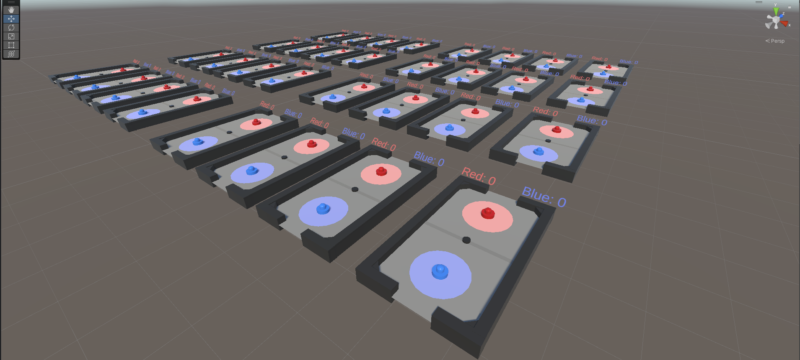

# Air Hockey Environment

## 1. Set up
It's a simple air hockey environment where you can train your own AI using self-play technic and [Unity ML-Agents library](https://github.com/Unity-Technologies/ml-agents). To start your own training, you need to follow these steps:
1. Clone this repo
2. Add this project to your [Unity Hub](https://unity.com/download)
3. Install [ML-Agents](https://github.com/miyamotok0105/unity-ml-agents/blob/master/docs/Installation-Windows.md)

## 2. Usage

In this environment all scripts are stored in the [./Assets/Environment/Scripts](https://github.com/drogovozDP/Air-Hockey-Environment/tree/main/Assets/Environment/Scripts) directory. You should construct your reward function in the [AirhockerTrainer.cs](https://github.com/drogovozDP/Air-Hockey-Environment/blob/main/Assets/Environment/Scripts/AI/AirhockerTrainer.cs) script. Don't change other scripts, it may cause incorrect behavior in [our inference](https://karl-competition.github.io/) when you upload your model.

You can also move the handles:

- Blue Handle
  - `W` - Up
  - `A` - Left
  - `D` - Right
  - `S` - Down

- Red Handle
    - `Up Arrow` - Up
    - `Left Arrow` - Left
    - `Right Arrow` - Right
    - `Down Arrow` - Down
  
